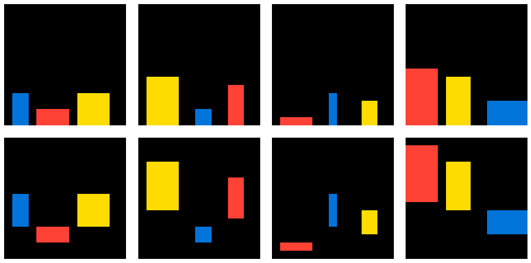

# Domain Specific Language for the Abstraction and Reasoning Corpus (ARC-DSL)

The DSL was created with the aim of being expressive enough to allow programs solving arbitrary ARC tasks, and generic, i.e. consisting of only few primitives, each useful for many tasks (see [`dsl.py`](dsl.py)). As a proof of concept, solver programs for the training tasks were written (see [`solvers.py`](solvers.py)). See [`arc_dsl_writeup.pdf`](arc_dsl_writeup.pdf) for a more detailed description of the work.


## Example solver program for task 00d62c1b written in the DSL


```python
def solve_00d62c1b(I):
    x1 = objects(I, T, F, F)
    x2 = colorfilter(x1, ZERO)
    x3 = rbind(bordering, I)
    x4 = compose(flip, x3)
    x5 = mfilter(x2, x4)
    O  = fill(I, FOUR, x5)
    return O
```

The function `solve_00d62c1b` takes an input grid `I` and returns the correct output grid `O`. An explanation of what the variables store and how their values were computed:

- `x1`: the set of objects extracted from the input grid `I` that are single-color only, where individual objects may only have cells that are connected directly, and cells may be of the background color (black); the result of calling the `objects` primitive on `I` with `univalued=True`, `diagonal=False` and `without_background=True`
- `x2`: the subset of the objects `x1` which are black; the result of filtering objects by their color, i.e. calling `colorfilter` with `objects=x1` and `color=ZERO` (black)
- `x3`: a function taking an object and returning `True` iff that object is at the border of the grid; the result of fixing the right argument of the `bordering` primitive to `I` by calling the function `rbind` on `function=bordering` and `fixed=I`
- `x4`: a function that returns the inverse of the previous function, i.e. a function that returns `True` iff an object does not touch the grid border; the result of composing the `flip` primitive (which simply negates a boolean) and `x3`
- `x5`: a single object defined as the union of objects `x2` for which function `x4` returns `True`, i.e. the black objects which do not touch the grid border (corresponding to the "holes" in the green objects); the result of calling `mfilter` (which combines `merge` and `filter`) with `container=x2` and `condition=x4`
- `O`: the output grid, created by coloring all pixels of the object `x5` yellow; the result of calling the `fill` primitive on `I` with `color=FOUR` (yellow) and `patch=x5`


## Another solver example: 5521c0d9



```python
def solve_5521c0d9(I):
    x1 = objects(I, T, F, T)
    x2 = merge(x1)
    x3 = cover(I, x2)
    x4 = chain(toivec, invert, height)
    x5 = fork(shift, identity, x4)
    x6 = mapply(x5, x1)
    O = paint(x3, x6)
    return O
```

- `x1`: the set of objects extracted from the input grid `I` that are single-color only, ignoring the background color; the result of calling the `objects` primitive on `I` with `univalued=True`, `diagonal=False` and `without_background=True`
- `x2`: all the objects treated as a single object, the result of calling the `merge` primitive on the objects `x1`
- `x3`: a new grid, where `x2` is removed (covered), i.e. replaced with the background color (black); the result of calling the `cover` primitive with `grid=I` and `patch=x2`
- `x4`: a function that takes an object and returns a vector pointing up by as much as that object is high; the result of composing the three functions `height`, `invert` and `height`; the result of calling the `chain` primitive with `h=toivec`, `g=invert` and `f=height`
- `x5`: a function that takes an object and shifts it as much upwards as it is high; the result of calling the `fork` primitive with `outer=shift`, `a=identity` and `b=x4`
- `x6`: all the objects shifted up by their heights, as a single object, obtained by appling the constructed function on the set of objects and merging the results; the result of calling the `mapply` primitive on `function=x5` and `container=x1`
- `O` the desired output grid, obtained by painting the resulting object onto the grid `x3` where the original objects were removed from; the result of calling the `paint` primitive on `grid=x3` and `obj=x6`
