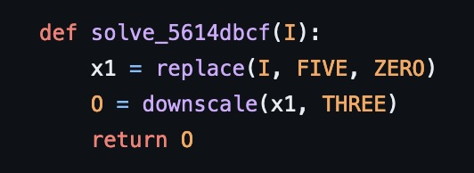
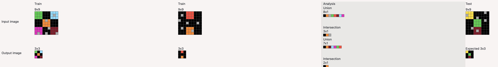
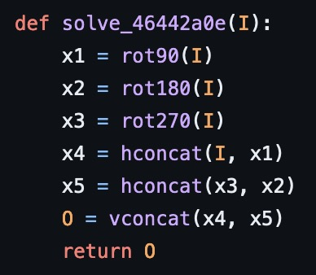
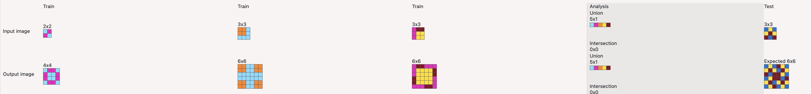
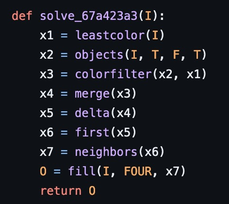
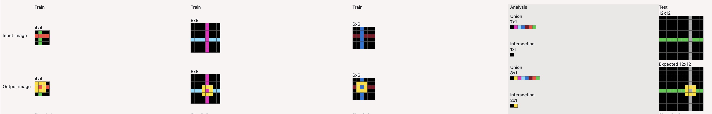

# Michael's DSL for ARC (Abstraction and Reasoning Corpus)

<table>
<tr>
<th>Code</th>
<th>Task</th>
</tr>
<tr>
<td></td>
<td></td>
</tr>
<tr>
<td></td>
<td></td>
</tr>
<tr>
<td></td>
<td></td>
</tr>
</table>

All 800 tasks in the ARC 1 dataset, has a handcrafted solution.
You may be wondering what is going on in a particular task, and you can see its implementation.
The [`solvers.py`](solvers.py) has the shortest solutions at the top, and the longest at the bottom.

---

The DSL was created with the aim of being expressive enough to allow programs solving arbitrary ARC tasks, and generic, i.e. consisting of only few primitives, each useful for many tasks (see ```dsl.py```). As a proof of concept, solver programs for the training tasks were written (see ```solvers.py```).

## Repo structure

These are the important files:
* [`arc_types.py`](arc_types.py) - description.
* [`constants.py`](constants.py) - Often used constants.
* [`dsl.py`](dsl.py) - The code for expressing a solution.
* [`main.py`](main.py) - description.
* [`solvers.py`](solvers.py) - All 800 tasks have a solution here.
* [`test.py`](tests.py) - Testing the DSL is behaving correctly.

## Discord

I hang out in the ARC channels on [Lab42](https://discord.gg/waRCYPEc6C) and [Yannic Kilcher](https://ykilcher.com/discord).
Great places for discussing ARC.

## License

MIT.
